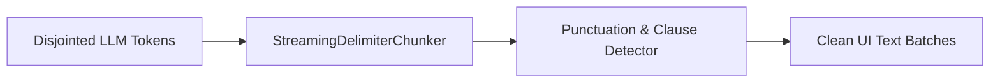

# genpark-streaming-token-delimiter-chunker-skill

A streaming delimiter tokenizer that prevents UI flickering by aggregating disjointed token fragments into grammatical and linguistic boundary chunks.

## Architecture

## Features
- **Configurable Chunk Modes**: Sentence, clause, and word boundary chunking.
- **Anti-Starvation Threshold**: Flushes buffer if size threshold is exceeded.
- **Standard Library**: 100% Python stdlib.
